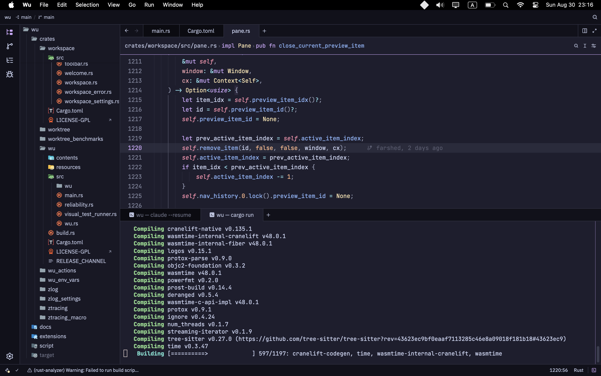
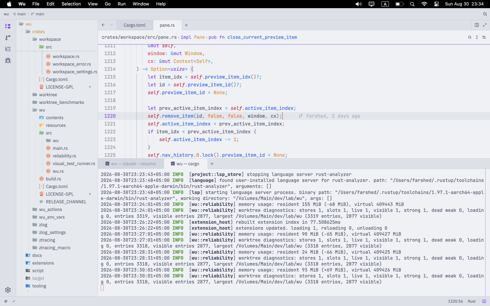

<div align="center">
  
  <h1>Wu</h1>
  <p>The fast, native code editor that doesn't get in your way.</p>
  <p><a href="https://github.com/farshed/wu/releases/latest"><strong>Download</strong></a></p>
</div>

---

Wu is a code editor for people who want the speed of a native app and the familiarity of VS Code. The name comes from [wu wei](https://en.wikipedia.org/wiki/Wu_wei): effortless action. The editor should do its job and stay out of the way.

Wu is a fork of [Zed](https://github.com/zed-industries/zed). It inherits Zed's editor core, GPU rendering, and language tooling, but strips out everything that isn't editing.

## Features

- **Native and fast.** Written in Rust, rendered on the GPU. No Electron or webviews. Opens instantly and stays responsive on large views.
- **Lightweight.** Base memory use is about 28% lower than even Zed.
- **No built-in AI features.** Bring whichever agent or harness you already use.
- **Feels like VS Code out of the box.** Layout, panels, and defaults are tuned so you don't have to relearn your editor.

---





## Docs

See [docs](https://wu.farshed.me).

## Install

Download the installer for your platform [here](https://github.com/farshed/wu/releases/latest). Then follow the steps below.

### macOS (Apple Silicon)

Wu is not signed with an Apple Developer certificate yet, so macOS will block it the first time you open it.

1. Download `Wu-aarch64.dmg`, open it, and drag Wu into your Applications folder.
2. Open Terminal and run:

   ```sh
   xattr -d com.apple.quarantine /Applications/Wu.app
   ```

3. Open Wu normally.

If you'd rather not use Terminal: open Wu once (you'll see a "Wu can't be opened" or "Apple could not verify" message), then go to **System Settings → Privacy & Security**, scroll down, and click **Open Anyway** next to Wu. Confirm with your password.

### Linux (x86_64 and aarch64)

Download `wu-linux-<arch>.tar.gz` and unpack it into `~/.local`:

```sh
tar -xzf wu-linux-$(uname -m).tar.gz -C ~/.local
ln -sf ~/.local/wu.app/bin/wu ~/.local/bin/wu
```

Make sure `~/.local/bin` is on your `PATH`, then run `wu`.

### Windows (x86_64)

Download and run `Wu-x86_64.exe`. The installer isn't code-signed, so Windows SmartScreen may warn you. Click **More info**, then **Run anyway**.

## Building

Wu builds the same way Zed does. See the [Zed development docs](https://zed.dev/docs/development).

## Licensing

Wu is licensed under GPL-3.0-or-later with Apache-2.0 components where marked. See [LICENSE-GPL](./LICENSE-GPL) and [LICENSE-APACHE](./LICENSE-APACHE).

Wu is a derivative work of [Zed](https://github.com/zed-industries/zed) and shares the same licenses.

## Acknowledgements

Thanks to the Zed team for building an excellent editor and releasing it as open source. Wu would not exist without their work.
